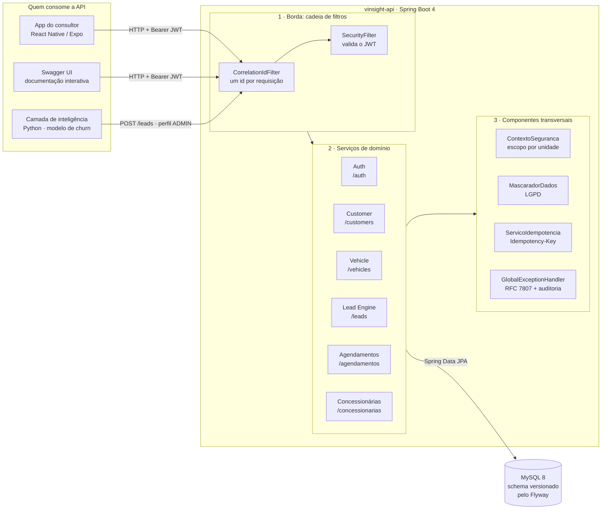
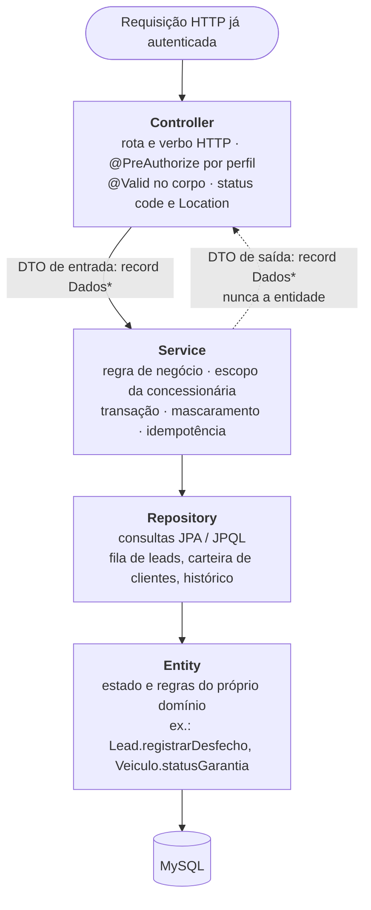
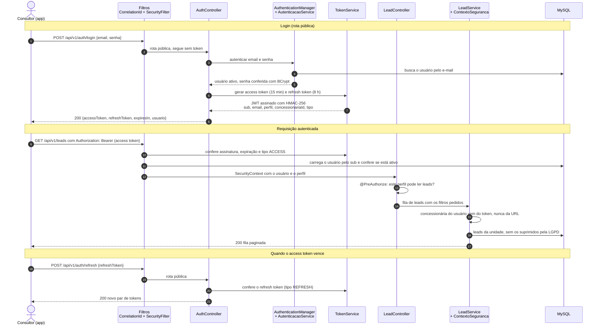
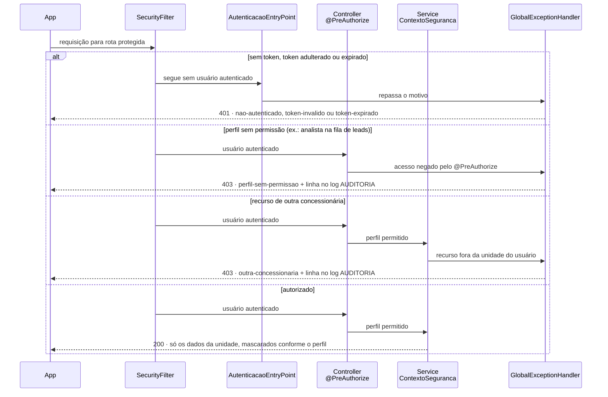

# VINSight Ford API

Backend Spring Boot da plataforma **VINSight Ford** — Challenge FIAP 2026 / Ford Motor Company / Desafio 02.

## Equipe

- **Glauco Heitor Gonçalves** — RM 555978
- **Pedro Henrique Junqueira** — RM 556278

## Sobre

API REST que sustenta a plataforma de retenção pós-venda da Ford: entrega ao **consultor de serviço
da concessionária** uma fila de clientes priorizada pelo risco de evasão, a visão 360° de cada
cliente e o passaporte de cada veículo, e registra o desfecho de cada contato para realimentar o
modelo de IA.

Organizada em serviços por domínio (**Auth**, **Customer**, **Vehicle**, **Lead Engine**,
**Agendamentos** e **Concessionárias**), com autenticação **JWT**, controle de acesso por **perfil**
e por **concessionária**, mascaramento de dados pessoais (**LGPD**) e erros padronizados em
**RFC 7807**.

## Arquitetura

A API é o backend SOA da plataforma: atende o **app do consultor** (React Native / Expo), recebe os
leads gerados pela **camada de inteligência** (Python) e guarda tudo num **MySQL** com schema
versionado pelo Flyway. É **stateless**: não há sessão no servidor, e cada requisição se identifica
com um token JWT.

### Componentes e responsabilidades



| Bloco | Componente | Responsabilidade |
|---|---|---|
| **Borda** | `CorrelationIdFilter` | Dá um id a cada requisição (header `X-Correlation-Id`), que aparece em toda linha de log e em todo erro |
| | `SecurityFilter` + `TokenService` | Validam o JWT (assinatura, expiração e tipo) e carregam o usuário e o perfil |
| **Serviços** | Auth · Customer · Vehicle · Lead Engine · Agendamentos · Concessionárias | Um pacote por domínio, cada um com controller, service, repository, entidades e DTOs |
| **Transversais** | `ContextoSeguranca` | Escopo de dados: o consultor só vê a própria concessionária, que vem do token e nunca da URL |
| | `MascaradorDados` | LGPD: CPF, telefone e e-mail mascarados para o perfil CONSULTOR |
| | `ServicoIdempotencia` | `Idempotency-Key`: reenviar a mesma ação não duplica o registro |
| | `GlobalExceptionHandler` + `AuditoriaAcesso` | Todo erro em RFC 7807 (`application/problem+json`); todo 403 registrado na trilha de auditoria |
| **Dados** | MySQL 8 + Flyway | Schema versionado (`db/migration`) e massa de demonstração separada (`db/seed`, só no perfil `dev`) |

### Camadas dentro de cada serviço



### Fluxo de autenticação com JWT

O access token vale **15 minutos** e o refresh token, **8 horas**. Os dois são assinados com
HMAC-256 e carregam `sub` (id do usuário), `email`, `perfil`, `concessionariaId` e `tipo`. A claim
`tipo` impede que um refresh token seja aceito no lugar de um access token, e vice-versa.



### Onde cada acesso é barrado

Há três pontos de controle, nesta ordem: **token** (401), **perfil** (403) e **concessionária do
recurso** (403). Endpoints públicos: `POST /api/v1/auth/login`, `POST /api/v1/auth/refresh`,
`GET /actuator/health` e o Swagger.



| Perfil | Escopo dos dados | Pode |
|---|---|---|
| `CONSULTOR` | Só a própria concessionária | Fila de leads e desfecho, clientes, veículos, agendamentos (dados pessoais mascarados) |
| `GERENTE` | Só a própria concessionária | O mesmo do consultor, com dados completos, e inativar clientes e veículos |
| `ANALISTA_FORD` | Rede inteira | Ler concessionárias (os indicadores consolidados são da US-36) |
| `ADMIN` | Rede inteira | Tudo, inclusive cadastrar concessionárias e receber leads do modelo |

## Stack

- **Java 21** (LTS)
- **Spring Boot 4.0.6** (com Jackson 3 e novos starters `spring-boot-starter-webmvc`)
- Spring Web · Spring Data JPA · Validation · **Actuator**
- **Spring Security 7** + **java-jwt (Auth0) 4.6.0** — autenticação JWT (US-29)
- **MySQL 8** (banco de dados) — inclusive na suíte de testes, em schema dedicado
- **Flyway** (migrations versionadas)
- **Lombok**
- **SpringDoc OpenAPI** (Swagger UI auto-gerado)
- **JaCoCo** (relatório de cobertura)

## Pré-requisitos

- JDK 21
- MySQL 8 rodando localmente (porta padrão `3306`). No Windows, se o serviço estiver parado:
  `Start-Service MySQL80` num PowerShell como administrador.
- Maven 3.9+, ou o `mvnw` que vem no repositório (baixa o Maven sozinho)

## Como rodar

### 1. Configurar credenciais do MySQL

O default é `root` / `fiap`. Se o seu MySQL usa outras credenciais, **não edite o código** — passe por
variável de ambiente:

```bash
DB_USER=seu_usuario DB_PASSWORD=sua_senha ./mvnw spring-boot:run
```

Variáveis reconhecidas: `DB_URL`, `DB_USER`, `DB_PASSWORD`, `JWT_SECRET`.

A URL JDBC já tem `createDatabaseIfNotExist=true`, então o schema `vinsight` é criado automaticamente na primeira execução — não precisa rodar `CREATE DATABASE` manualmente.

> Se aparecer `Public Key Retrieval is not allowed`, o MySQL 8 está usando `caching_sha2_password`.
> A URL de dev já inclui `allowPublicKeyRetrieval=true` para resolver isso.

### 2. Subir a aplicação

```bash
./mvnw spring-boot:run
```

ou, no Windows:

```cmd
mvnw.cmd spring-boot:run
```

A API sobe em `http://localhost:8080`. Na primeira execução o Flyway cria todo o schema
(`db/migration`, V1 a V14) e, no perfil `dev`, carrega a massa de demonstração (`db/seed`, V900 a
V903). Não é preciso rodar nenhum SQL à mão.

### 3. Conferir que subiu

```bash
curl http://localhost:8080/actuator/health
```

Deve responder `200` com `{"status":"UP"}`.

### 4. Fazer login e chamar um endpoint protegido

**Pelo Swagger** (http://localhost:8080/swagger-ui.html):
1. Em **Autenticação → POST /api/v1/auth/login**, clique em *Try it out* e envie
   `{"email":"consultor@ford.com.br","senha":"consultor123"}`.
2. Copie o `accessToken` da resposta.
3. Clique em **Authorize** (cadeado no topo), cole o token e confirme.
4. Chame **GET /api/v1/leads**: a fila de leads da Ford Morumbi, do maior risco para o menor.

**Pelo terminal:**

```bash
curl -X POST http://localhost:8080/api/v1/auth/login \
  -H "Content-Type: application/json" \
  -d '{"email":"consultor@ford.com.br","senha":"consultor123"}'

curl http://localhost:8080/api/v1/leads -H "Authorization: Bearer <accessToken>"
```

Sem o header `Authorization`, a mesma chamada responde **401**.

## Perfis de execução

| Perfil | Banco | Massa de demonstração | Uso |
|---|---|---|---|
| `dev` (**default**) | MySQL local | sim (`db/seed`) | desenvolvimento e demonstração |
| `prod` | MySQL via `DB_URL` | não | tudo por variável de ambiente, sem credencial no repo |
| `test` | MySQL, schema `vinsight_test` | não | suíte automatizada — nunca toca o banco `vinsight` |

```bash
SPRING_PROFILES_ACTIVE=prod DB_URL=... DB_USER=... DB_PASSWORD=... ./mvnw spring-boot:run
```

## Usuários de demonstração

Criados pela massa de demonstração do perfil `dev` (senhas guardadas em BCrypt).

| E-mail | Senha | Perfil | Concessionária | Bom para mostrar |
|---|---|---|---|---|
| `consultor@ford.com.br` | `consultor123` | CONSULTOR | Ford Morumbi (SP-001) | Fluxo principal, dados mascarados |
| `consultor.campinas@ford.com.br` | `consultor123` | CONSULTOR | Ford Campinas (SP-014) | Fila e carteira de outra unidade |
| `consultor.poa@ford.com.br` | `consultor123` | CONSULTOR | Ford Porto Alegre (RS-003) | 403 ao abrir clientes e leads de Morumbi |
| `gerente@ford.com.br` | `gerente123` | GERENTE | Ford Morumbi (SP-001) | Mesmos dados, sem máscara |
| `analista@ford.com.br` | `analista123` | ANALISTA_FORD | rede inteira | 403 por perfil na fila de leads |
| `admin@ford.com.br` | `admin123` | ADMIN | rede inteira | Acesso total |

Consultores de unidades diferentes existem de propósito: são eles que provam o escopo de dados por
concessionária. O cliente **Carlos Pereira** (id 1) comprou em Morumbi e fez revisão em Campinas,
então aparece para as duas unidades e dá 403 para Porto Alegre.

## Testes automatizados

```bash
./mvnw verify
```

Com o MySQL no ar, esse comando roda a suíte inteira e gera o relatório de cobertura.

### Resultado

Última execução completa (25/09/2026, `./mvnw verify`):

```
[INFO] Tests run: 133, Failures: 0, Errors: 0, Skipped: 0
[INFO] BUILD SUCCESS
```

| Pacote | Cobertura de linhas |
|---|---|
| `lead` (Lead Engine) | 98% |
| `infra.security` (JWT, escopo, mascaramento, auditoria) | 97% |
| `agendamento` | 93% |
| `cliente` (Customer Service) | 89% |
| `infra.exception` (RFC 7807) | 89% |
| `veiculo` (Vehicle Service) | 82% |
| `usuario`, `shared`, `ordemservico`, `infra.web`, `config` | 100% |
| **Total** | **92%** |

- Relatório de cobertura: `target/site/jacoco/index.html` (JaCoCo).
- Resultado de cada teste: `target/surefire-reports/`.

### Como a suíte é montada

| Tipo | Classes | Como roda |
|---|---|---|
| **Integração** (API ponta a ponta) | `*ControllerTest`, `ErrosApiTest`, `ErroInternoTest` | Sobe a aplicação inteira e faz requisições HTTP pelo MockMvc, com **token JWT real** em cada chamada, contra o **MySQL de verdade** |
| **Unidade** (regras de domínio) | `VeiculoTest`, `LeadTest`, `MascaradorDadosTest`, `SenhasDemonstracaoTest` | JUnit 5 puro e Mockito, sem Spring nem banco |

- **Banco isolado:** o perfil `test` usa um schema separado, o `vinsight_test`, criado sozinho e com
  todas as migrations (V1 a V14), mas sem a massa de demonstração. Os testes nunca tocam o banco
  `vinsight` da apresentação.
- **Dados próprios:** cada teste carrega `src/test/resources/dados-teste.sql`, uma massa pequena
  (2 concessionárias, 7 usuários, 4 clientes, 6 leads) em que cada registro existe para provar um
  caso: cliente sem consentimento, cliente em duas carteiras, garantia perto do fim.
- **Nenhum resíduo:** cada teste roda numa transação desfeita no fim, inclusive o que a API gravou.
  A ordem de execução não importa, e o `vinsight_test` termina vazio.
- **Data fixa:** o "hoje" dos testes é 22/09/2026 (`RelogioFixoConfig`), então os status de garantia
  e revisão não mudam com o calendário.
- **Schema conferido:** com `ddl-auto=validate`, a suíte também falha se uma entidade divergir das
  migrations.

### O que é coberto

Cada recurso tem cenários de **sucesso**, **erro** (422, 404, 409) e **acesso não autorizado**
(401 sem token ou com token inválido, 403 por perfil e 403 por outra concessionária). Todos os
cenários BDD das histórias estão automatizados:

| História | Cenário | Teste |
|---|---|---|
| US-29 | Login gera JWT com as claims do contrato; access e refresh não se confundem; token expirado → 401 | `AuthControllerTest` |
| US-29 | Credencial errada e e-mail inexistente dão a mesma resposta (não revela o e-mail) | `AuthControllerTest` |
| US-30 | Consultor vê só a própria unidade; consultor da unidade A pedindo lead da unidade B → 403 | `LeadControllerTest`, `AgendamentoControllerTest` |
| US-30 | Perfil sem permissão → 403 (analista na fila, consultor escrevendo em concessionária) | todos os `*ControllerTest` |
| US-31 | Validação → 422 listando o campo; erro inesperado → 500 sem stack trace nem nome de classe | `ErrosApiTest`, `ErroInternoTest` |
| US-31 | Criação → 201 com `Location` | `ClienteControllerTest`, `VeiculoControllerTest`, `AgendamentoControllerTest` |
| US-33 | Visão 360° agregada; mascaramento por perfil; cliente inexistente → 404 | `ClienteControllerTest` |
| US-34 | Passaporte completo, histórico em ordem decrescente; VIN inválido → 422 **sem chamar o serviço** (verificado com Mockito) | `VeiculoControllerTest` |
| US-35 | Fila por score decrescente; cliente sem consentimento suprimido (LGPD); desfecho AGENDADO encerra o lead; reenvio com `Idempotency-Key` não duplica | `LeadControllerTest` |

Para zerar o banco de teste: `DROP DATABASE vinsight_test;`. Ele é recriado na execução seguinte.

## Documentação interativa

- **Swagger UI:** http://localhost:8080/swagger-ui.html
- **OpenAPI JSON:** http://localhost:8080/api-docs

Todos os endpoints estão anotados com `@Operation` e `@Tag`, então o Swagger já apresenta as operações agrupadas por recurso.

## Estrutura de pacotes

Um pacote por domínio (*package-by-feature*): tudo o que um serviço precisa fica junto, e o que é
compartilhado fica em `infra/` e `shared/`.

```
br.com.fiap.vinsight_api/
├── usuario/          Auth: login e refresh (AuthController), Usuario e Perfil
├── cliente/          Customer Service: busca, visão 360°, carteira por relacionamento
├── veiculo/          Vehicle Service: passaporte por VIN, garantia e revisão derivadas
├── lead/             Lead Engine: fila priorizada, desfecho, supressão LGPD
├── agendamento/      Agendamentos por concessionária
├── concessionaria/   Unidades da rede Ford
├── ordemservico/     Histórico de serviço (base da visão 360° e do passaporte)
├── infra/
│   ├── security/     JWT (TokenService, SecurityFilter), escopo (ContextoSeguranca),
│   │                 mascaramento (MascaradorDados) e auditoria (AuditoriaAcesso)
│   ├── exception/    GlobalExceptionHandler e catálogo de erros RFC 7807 (TipoProblema)
│   ├── idempotencia/ Idempotency-Key (ServicoIdempotencia)
│   └── web/          CorrelationIdFilter
├── shared/           Embeddables (Endereco, DadosContato, DadosPessoais), DadosPagina, FusoHorario
└── config/           Swagger, relógio (Clock) e suporte à paginação
```

Cada pacote de domínio contém: `Controller`, `Service`, `Repository`, entidades, DTOs (records
`Dados*`) e seus enums.

## Endpoints — visão geral

Base path: **`/api/v1`**.

### Clientes (Customer Service — US-33)

Filtrados pela **carteira da unidade** do usuário: um cliente aparece para toda concessionária com
que tem vínculo (cadastro, compra, serviço ou agendamento). CPF, telefone e e-mail saem
**mascarados para o CONSULTOR**; GERENTE e ADMIN veem os dados completos.

| Método | Endpoint | Descrição |
|---|---|---|
| POST | `/customers` | Cadastra novo cliente (entra na carteira de quem cadastrou) |
| GET | `/customers?q=` | Busca por nome parcial, CPF ou telefone (paginado); sem `q`, lista a carteira |
| GET | `/customers/{id}` | Detalha o cadastro |
| GET | `/customers/{id}/overview` | Visão 360°: cadastro, veículos, consentimento, NPS e resumo do histórico |
| GET | `/customers/{id}/vehicles` | Lista veículos do cliente |
| PUT | `/customers/{id}` | Atualiza cliente |
| DELETE | `/customers/{id}` | Inativa cliente (soft delete) — GERENTE e ADMIN |

### Veículos (Vehicle Service — US-34)

Identificados pelo **VIN** (17 caracteres, sem I, O e Q). VIN mal formado responde **422 sem
consultar o banco**. Um veículo é visível quando o **dono** está na carteira da unidade do usuário.

| Método | Endpoint | Descrição |
|---|---|---|
| POST | `/vehicles` | Cadastra veículo para um cliente da carteira (`Location: /vehicles/{vin}`) |
| GET | `/vehicles?placa=` | Busca por placa, com ou sem hífen (paginado); sem placa, lista a carteira |
| GET | `/vehicles/{vin}` | **Passaporte**: garantia, próxima revisão, aderência à rede, telemetria e histórico |
| PUT | `/vehicles/{vin}` | Atualiza veículo (transferir para outro dono exige o novo dono na carteira) |
| DELETE | `/vehicles/{vin}` | Inativa veículo (status = INATIVO) — GERENTE e ADMIN |
| GET | `/vehicles/{vin}/agendamentos` | Agendamentos do veículo na unidade do usuário |

Campos **derivados na leitura** (não armazenados): `garantia.status` (`ATIVA`, `PROXIMA_DO_FIM` com 90
dias ou menos, `ENCERRADA`), `proximaRevisaoPrevista.situacao` (`EM_DIA`, `PROXIMA` com 30 dias ou
1.000 km ou menos, `VENCIDA`) e `aderenciaRede` (fração das ordens de serviço feitas na rede Ford).

### Agendamentos

| Método | Endpoint | Descrição |
|---|---|---|
| POST | `/agendamentos` | Cria novo agendamento |
| GET | `/agendamentos` | Lista (filtros: `dataInicio`, `dataFim`, `concessionariaId`, `status`) |
| GET | `/agendamentos/{id}` | Detalha agendamento |
| **PATCH** | `/agendamentos/{id}/status` | Atualiza status (atualização parcial) |
| DELETE | `/agendamentos/{id}` | Cancela (status = CANCELADO) |

### Concessionárias

| Método | Endpoint | Descrição |
|---|---|---|
| POST | `/concessionarias` | Cadastra nova concessionária |
| GET | `/concessionarias` | Lista ativas (paginado) |
| GET | `/concessionarias/{id}` | Detalha concessionária |
| PUT | `/concessionarias/{id}` | Atualiza concessionária |
| DELETE | `/concessionarias/{id}` | Inativa (soft delete) |
| GET | `/concessionarias/{id}/agendamentos` | Lista agendamentos da concessionária |

### Leads (Lead Engine — US-35)

A **fila de trabalho do consultor**: só a unidade dele, do maior score para o menor, **sem leads
suprimidos**. Cliente sem consentimento (LGPD) nunca aparece; o lead fica registrado como suprimido
com o motivo `LGPD_OPT_OUT`.

| Método | Endpoint | Descrição |
|---|---|---|
| GET | `/leads?status=OPEN&risco=ALTO` | Fila paginada. `risco`: `ALTO` (≥ 0,70), `MEDIO` (0,40 a 0,69), `BAIXO` (< 0,40), derivado do score |
| GET | `/leads/{id}` | Detalhe com supressão (se houver) e histórico de desfechos |
| **PATCH** | `/leads/{id}` | Registra o desfecho de um contato. Header opcional `Idempotency-Key` |
| POST | `/leads` | Entrada de lead do modelo de churn (ADMIN); cliente sem consentimento entra já suprimido |

Desfechos: `CONTATADO` e `SEM_SUCESSO` mantêm o lead aberto; `AGENDADO`, `RECUSADO` e
`NUMERO_INVALIDO` o encerram (novo desfecho → 409). Cada desfecho é gravado em `desfechos_lead`, com
autor e data, como base para o retreinamento do modelo. Reenviar a mesma `Idempotency-Key` devolve a
resposta original (header `Idempotent-Replayed: true`) sem gravar de novo.

Detalhes completos de cada endpoint (request/response, validações, exemplos) estão no **Swagger UI**.

## Uso de métodos HTTP

| Método | Quando usamos | Idempotência |
|---|---|---|
| GET | Leituras (detalhar/listar) | Sim |
| POST | Criação de recurso (não-idempotente) | Não |
| PUT | Substituição completa do recurso | Sim |
| PATCH | Atualização **parcial** — usado em `agendamentos/{id}/status` e no desfecho `leads/{id}` | Sim (o de lead, com `Idempotency-Key`) |
| DELETE | Remoção lógica (soft delete via flag `ativo` ou mudança de status) | Sim |

## Tratamento de erros

Toda resposta de erro, em qualquer endpoint, sai no formato **Problem Details (RFC 7807)**, com
`Content-Type: application/problem+json`. Quem monta a resposta é sempre o
[`GlobalExceptionHandler`](src/main/java/br/com/fiap/vinsight_api/infra/exception/GlobalExceptionHandler.java),
inclusive nos 401 do filtro de segurança.

```json
{
  "type": "https://vinsight.ford/errors/validacao",
  "title": "Erro de validação",
  "status": 422,
  "detail": "Um ou mais campos estão inválidos.",
  "instance": "/api/v1/agendamentos",
  "timestamp": "2026-09-23T00:46:35.202Z",
  "correlationId": "d76270af-d785-49dc-bd33-8a9feb28ff5d",
  "violacoes": [ { "campo": "tipoServico", "mensagem": "valor não permitido. Aceitos: REVISAO_PROGRAMADA, TROCA_OLEO, REPARO, GARANTIA, RECALL" } ]
}
```

- **`type`** identifica a situação e é estável: o app trata o erro por ele, nunca pelo texto.
- **`detail`** e **`violacoes[].mensagem`** vêm em português e podem ir direto para a tela.
- **`correlationId`** é o mesmo do header `X-Correlation-Id` e da linha do log do servidor.
- **500** traz só "Erro inesperado. Informe o correlationId ao suporte.": nada de stack trace ou
  nome de classe. O detalhe fica no log.

### Tabela de códigos HTTP

| HTTP | `type` | Quando |
|---|---|---|
| 200 | — | Leitura ou atualização com sucesso |
| 201 | — | Criação com sucesso, com header `Location` |
| 204 | — | Remoção (inativação) com sucesso |
| 400 | `requisicao-invalida` | JSON malformado, parâmetro de URL com tipo errado, `?sort=` com campo inexistente |
| 401 | `nao-autenticado` | Rota protegida sem token |
| 401 | `token-expirado` · `token-invalido` | Token vencido, adulterado, ou refresh usado no lugar do access |
| 401 | `credenciais-invalidas` | Login errado (e-mail inexistente dá a mesma resposta) |
| 403 | `perfil-sem-permissao` | O perfil não pode usar o endpoint |
| 403 | `outra-concessionaria` | O recurso é de outra unidade |
| 404 | `nao-encontrado` | Recurso ou rota inexistente |
| 405 | `metodo-nao-permitido` | Verbo HTTP não suportado na rota |
| 409 | `conflito` | Regra de negócio (ex.: lead já encerrado) ou registro duplicado (CPF, VIN, placa) |
| 422 | `validacao` | Campo obrigatório ausente, formato inválido ou valor fora do enum, com a lista de `violacoes` |
| 500 | `erro-interno` | Falha inesperada, com mensagem genérica |

O `type` completo é `https://vinsight.ford/errors/<código>`.

## Banco de dados

### Conexão

- **JDBC URL:** `jdbc:mysql://localhost:3306/vinsight?createDatabaseIfNotExist=true&useSSL=false&serverTimezone=America/Sao_Paulo`
- **Schema:** `vinsight` (criado automaticamente)
- **Dialect:** `org.hibernate.dialect.MySQLDialect`
- **ddl-auto:** `validate` — Hibernate apenas valida o schema; o Flyway é quem cria

### Migrations

Flyway controla o schema versionado. Migrations em `src/main/resources/db/migration/`:

| Versão | Arquivo | Descrição |
|---|---|---|
| V1 | `V1__create_concessionaria_table.sql` | Tabela `concessionarias` |
| V2 | `V2__create_cliente_table.sql` | Tabela `clientes` |
| V3 | `V3__create_veiculo_table.sql` | Tabela `veiculos` + FKs para `clientes` e `concessionarias` |
| V4 | `V4__create_agendamento_table.sql` | Tabela `agendamentos` + FKs para `veiculos` e `concessionarias` |
| V5 | `V5__create_lead_table.sql` | Tabela `leads` + FKs para `clientes` e `veiculos` |
| V6 | `V6__create_usuario_table.sql` | Tabela `usuarios` (perfil + concessionária) — base da US-29/30 |
| V7 | `V7__create_ordem_servico_table.sql` | Tabela `ordens_servico` — histórico e insumo do Service Share |
| V8 | `V8__alter_lead_add_concessionaria_e_campos_contrato.sql` | `concessionaria_id`, `motivo_contato`, `acao_recomendada`, `perfil_comportamental` |
| V9 | `V9__alter_cliente_add_consentimento_e_nps.sql` | Consentimento LGPD, canal preferido e NPS |
| V10 | `V10__alter_veiculo_add_garantia_e_telemetria.sql` | Cor, quilometragem, garantia, próxima revisão, telemetria |
| V11 | `V11__create_requisicao_idempotente_table.sql` | Suporte ao header `Idempotency-Key` |
| V12 | `V12__alter_concessionaria_add_codigo.sql` | Código da unidade (ex.: `SP-001`) |
| V13 | `V13__alter_cliente_add_concessionaria_cadastro.sql` | Unidade que cadastrou o cliente (carteira da US-33) |
| V14 | `V14__lead_desfecho_e_supressao.sql` | Supressão do lead (LGPD) e tabela `desfechos_lead` |

Massa de demonstração em `src/main/resources/db/seed/V900__seed_demo_data.sql`, carregada **apenas no
perfil `dev`** (o `prod` não inclui `db/seed` em `spring.flyway.locations`). O arquivo é gerado, não
editado à mão: 3 concessionárias, 8 usuários, 30 clientes, 37 veículos, 148 ordens de serviço,
19 agendamentos e 33 leads.

Correções e complementos da massa ficam em `db/seed/V9xx`, numerados depois da V900, para rodar
depois dela tanto num banco novo quanto num existente: `V901` (vocabulário de `tipoServico`) e `V902`
(cliente atendido em duas unidades, que demonstra a carteira por relacionamento) e `V903` (status de
lead no vocabulário do contrato e supressão LGPD dos 5 leads de clientes sem consentimento).

Para regerar: `python tools/gen_seed.py`. O script usa semente fixa, então a saída é sempre idêntica.
Se regerar **depois** de o seed já ter sido aplicado, o checksum muda e o Flyway aborta — nesse caso,
`DROP DATABASE vinsight;` e suba de novo.

> **Regra:** nunca editar uma migration já aplicada. Sempre criar uma nova `V{n+1}__nome.sql` com `ALTER TABLE` se for ajustar schema existente.

## Decisões de projeto

**Segurança e acesso**

- **JWT stateless no padrão da disciplina** — `TokenService` + `SecurityFilter` (`OncePerRequestFilter`)
  + `@EnableMethodSecurity`, com as regras de perfil em `@PreAuthorize` em cada endpoint. Sem sessão
  no servidor.
- **Access e refresh diferenciados pela claim `tipo`** — um refresh token vazado não serve para
  chamar a API, e um access token não renova a sessão.
- **Token inválido não barra a requisição no filtro** — ela segue sem usuário e quem responde o 401
  é o `AutenticacaoEntryPoint`. Assim as rotas públicas (como o `/auth/refresh`) continuam
  funcionando mesmo que o app mande junto um token vencido.
- **Escopo por concessionária no service, a partir do token** — o `@PreAuthorize` decide *qual
  perfil* acessa; o `ContextoSeguranca` decide *quais dados* ele vê. A unidade nunca vem de
  parâmetro da requisição.
- **Carteira por relacionamento** — um cliente pertence a toda concessionária com que tem vínculo
  (cadastro, compra, serviço ou agendamento). Amarrar à unidade de compra impediria atender um carro
  vendido por outra unidade, e liberar a rede inteira quebraria o escopo.
- **Mascaramento no backend** — o app nunca desmascara. Um valor mascarado reenviado num PUT é
  recusado (422), para não sobrescrever o dado real.

**Contrato REST**

- **Erros em RFC 7807** — `type` estável por situação (`token-expirado`, `outra-concessionaria`...),
  para o app tratar erro pelo código e não pelo texto. Validação responde 422; 500 nunca expõe
  stack trace.
- **Envelope de paginação próprio (`DadosPagina`)** — campos planos na raiz (`page`, `size`,
  `totalElements`, `totalPages`), como no contrato, sem depender do formato interno do Spring.
- **Status derivados na leitura** — faixa de risco do lead, status da garantia e situação da revisão
  são calculados a partir do score e das datas, nunca gravados. Não ficam desatualizados.
- **`Idempotency-Key` no desfecho do lead** — o app reenvia a ação depois de uma queda de rede sem
  duplicar o registro.

**Dados**

- **MySQL em todos os perfis, sem H2** — banco real local, o mesmo ecossistema usado na faculdade. O
  isolamento dos testes vem de um **schema separado** (`vinsight_test`), não de um banco in-memory:
  os testes exercitam as migrations e o dialeto de verdade.
- **Seed separado das migrations** — `db/migration` é schema; `db/seed` é dado de demonstração, lido
  só pelo perfil `dev`. Correções da massa entram como `V9xx`, depois da V900, sem editar o que já
  foi aplicado.
- **Embeddables como classes Lombok** (não records) — JPA 3.x não suporta records como `@Embeddable`.
  Records ficam só nos DTOs.
- **Soft delete** — `ativo=false` em Cliente e Concessionária, mudança de `status` em Veículo e
  Agendamento. Histórico nunca é perdido.
- **FKs `LAZY` + consultas com `JOIN FETCH`** — evita N+1 nas listagens, como na fila de leads.
- **Histórico de desfechos imutável** — cada contato vira uma linha em `desfechos_lead`, com autor e
  data: é a base do retreinamento do modelo.

Challenge FIAP 2026 — Ford Motor Company — Grupo 02.
